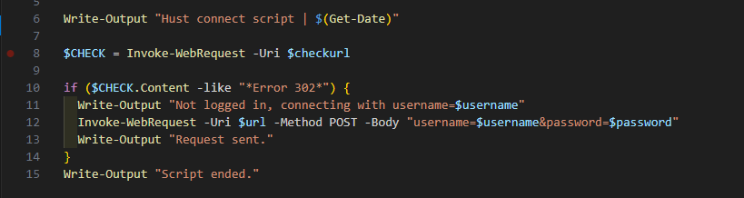

# HUST Hotspot Auto-login script

I'm tired about our lab's internal network at [HUST](https://hust.edu.vn) being disconnected and requiring manual login every ~~24~~ 8 hours. This script will check if login is needed and automatically send login request without the need of entering username/password. To make it run periodicly, use `cronjob` (for Linux friends) or `Task Scheduler` (for Windows friends).



However, this script is still unable to detect location of login page, you need to specify it yourself. (Maybe this can be done in future release?)

> [!NOTE]
> It is not recommended to use this script on your personal laptops as you will not connect to [HUST](https://hust.edu.vn) 24/7, and pinging internal-only sites will only waste your precious resources.

Of course, you will need [HUST](https://hust.edu.vn) credentials to login and you must connect to [HUST](https://hust.edu.vn) internet hotspots to use this scripts.

## Metric exporter for Telegraf

If you want to wrap HUST hotspot status page and make it monitorable, you can try using the file `status_hustwf.sh` with [Telegraf](https://github.com/influxdata/telegraf)'s `inputs.exec` plugin:

```toml
# telegraf.conf
[[inputs.exec]]
    commands = ["/bin/bash '/usr/local/bin/hustwf_status.sh'"]
    data_format = "prometheus"
```

> [!IMPORTANT]
> Remember to put the scipt at somewhere which can executable, e.g. `/usr/local/bin`

## In-secure password store

As you can see, *credentials are stored inside the script as plaintext*. I know, saving credentials as plaintext inside the script is **never** a good way. But this script is made for my personal uses and secure password store methods are too complex.

> [!TIP]
> Another way on bash you can try is create a file named `.hust_cred` as follow:
> 
> ```bash
> username=''
> password=''
> ```
>
> Then update the main script with
> 
> ```bash
> # remove username='' 
> # remove password=''
> # add this
> source .hust_cred
> ```

## Notes

> [!CAUTION]
> **Use this at your own risks.**
